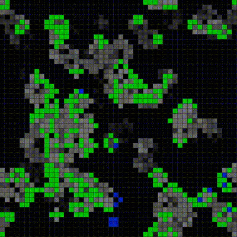

# Game of Life SDL
Conway's Game of Life using SDL2

### Description:

This is an implementation of [Conway's Game of Life](https://en.wikipedia.org/wiki/Conway%27s_Game_of_Life) using [SDL2](https://www.libsdl.org/) libarary for graphics and user input.

In this implementation, world wraps around, that is, cell to the left of leftmost cell is the rightmost cell, right of the rightmost is the leftmost one. World wraps around both horizontally and vertically.

In order to prevent stable state, random cells are made alive every 512 generations ("aliens").

### Controls:

- `arrow up` - increase game speed
- `arrow down` - decrease game speed
- `space` - toggle pause/play
- `a` - inject aliens
- `c` - clear the world
- `n` - go to next generation
- `q` - quit
- `+` or `=` - increase cell size
- `-` - decrease cell size
- left mouse click to toggle cell

